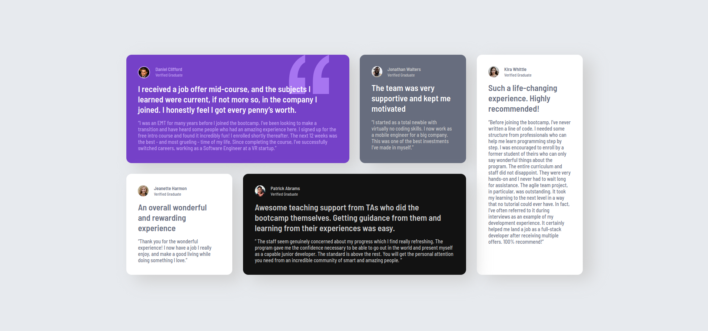

# Frontend Mentor Challenge: Testimonial Grid Section 
## Overview
In this repository, I have attempted to replicate the design of [Frontend Mentor's Testimonial Grid Section challenge](https://www.frontendmentor.io/challenges/testimonials-grid-section-Nnw6J7Un7).  The challenge is the first of the Junior-level challenges that I attempted, and, although it does not involve any JavaScript, it does use CSS grid to structure the layout of the page.
## Tools Used
* HTML
* CSS
## Challenges
Each testimonial in the grid shares some design elements, so the challenging part of this project was figuring out how to apply the design to the classes without spending too much time tweaking each individual element.  Also, working with a background element on one testimonial was interesting, adding a bit of complexity to an otherwise minimal design.
## Submitted Work
My finished website was published as a [Github Page](https://grimmaldi.github.io/fe-mentor-testimonial-grid-section/).  If you do not wish to check the link and just want to see the image, I've taken a screenshot and posted it below:
 
